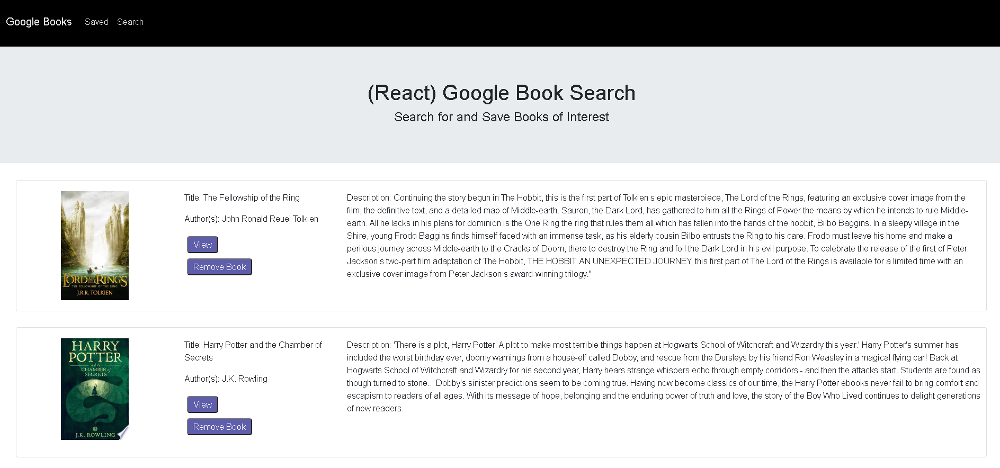

# Google Book Search

application: https://afternoon-everglades-47220.herokuapp.com/  
 
James Merges  
email: jamesmerges1@gmail.com  
github: https://github.com/jmerges  
linkedin: https://www.linkedin.com/in/james-merges-b938401b7/  

## Description

This full stack app is a book searcher / saver that utilizes MongoDB and React.
 The app utilizes the google book API to allow users to search for books; MongoDB is used
 to save books at the user's whim.  
 

## Preview

